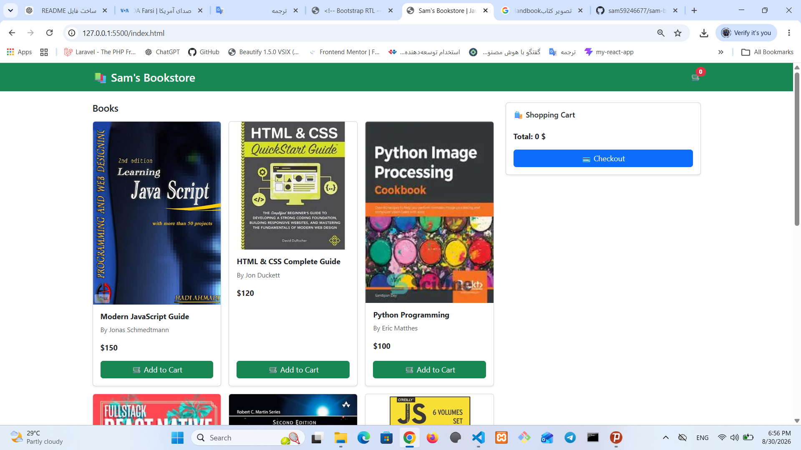
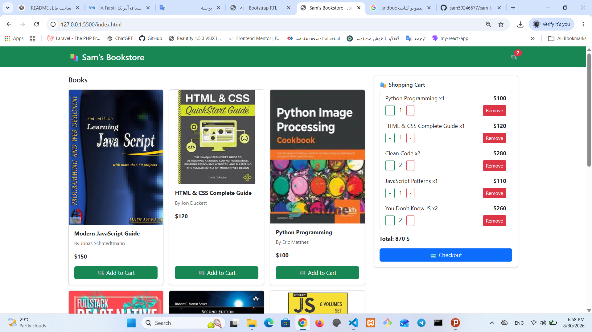
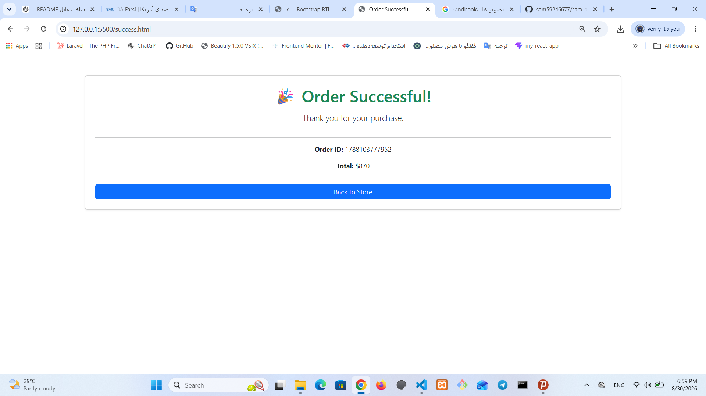

# 📚 Sam's Bookstore

A simple and responsive online bookstore built with **HTML, CSS, JavaScript, jQuery, and Bootstrap**.

This project simulates an e-commerce shopping experience where users can browse books, add products to the cart, manage quantities, complete checkout, and view order confirmation.

## 🚀 Live Demo

🔗 https://sam59246677.github.io/sam-bookstore/

## 📸 Screenshots

### Home Page



### Shopping Cart



### Order Success



## ✨ Features

* Display products dynamically using JavaScript
* Add books to shopping cart
* Increase and decrease product quantity
* Remove items from cart
* Calculate total price automatically
* Save cart data using LocalStorage
* Multi-step checkout process
* Customer information form validation
* Order summary before confirmation
* Order success page
* Responsive design for different screen sizes

## 🛠 Technologies Used

* HTML5
* CSS3
* JavaScript (ES6 Modules)
* jQuery
* Bootstrap 5
* LocalStorage API
* Git & GitHub Pages

## 📂 Project Structure

```
sam-bookstore/

│
├── assets/
│   └── images/
│
├── css/
│   └── style.css
│
├── Js/
│   ├── app.js
│   ├── cart.js
│   ├── checkout.js
│   ├── products.js
│   └── success.js
│
├── screenshots/
│   ├── Home.png
│   ├── Cart.png
│   └── success.png
│
├── index.html
├── success.html
└── README.md
```

## ▶️ How To Run

1. Clone the repository:

```bash
git clone https://github.com/sam59246677/sam-bookstore.git
```

2. Open the project folder:

```bash
cd sam-bookstore
```

3. Run the project using a local server.

For example, you can use:

* VS Code Live Server extension

## 📌 Notes

This project was created as a frontend practice project to improve skills in JavaScript DOM manipulation, modular JavaScript, LocalStorage, and responsive UI development.

## 👨‍💻 Author

Sam Rostami

GitHub:
https://github.com/sam59246677

```
```
